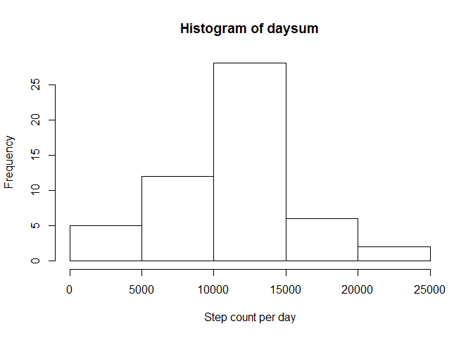
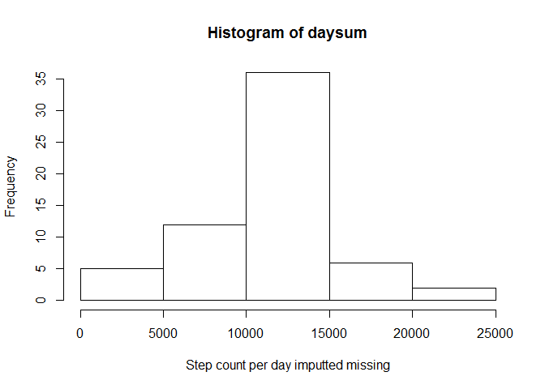
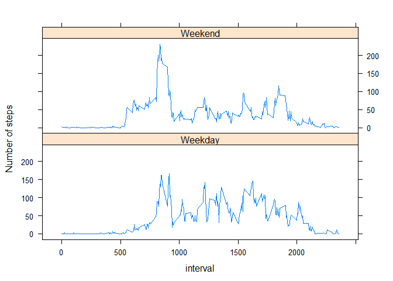

Peer Reviewed Assignment for the Reproducible Research Course
===============================================================================
# Loading required libraries

```r
library(dplyr)
```

```
## 
## Attaching package: 'dplyr'
## 
## The following object is masked from 'package:stats':
## 
##     filter
## 
## The following objects are masked from 'package:base':
## 
##     intersect, setdiff, setequal, union
```

```r
library(tidyr)
library(reshape2)
library(lattice)
```
# Loading and preprocessing the data

1. Load the data

```r
setwd("c:/RR/ReproRes/repdata_data_activity")
activity <- read.csv("activity.csv",header=TRUE)
```
2. Process/transform the data

```r
step_data <- activity[complete.cases(activity),]
step_data$interval <- sprintf("%04d", step_data$interval)
step_data$int_time <- strptime(step_data$interval, format = "%H%M")
```

# What is the mean total number of steps taken

Ignoring missing data

1.  Make a histogram of total number of steps taken each day

```r
step_data <- transform(step_data, dayf=factor(date))
daysum <- tapply(step_data$step, step_data$dayf, sum)
hist(daysum, xlab = "Step count per day")
```

 

2. Calculate and report the mean and median total number of steps taken per day

First calculate total number of steps per day

```r
step_sum <- tapply(step_data$steps,step_data$dayf, sum)
daily_steps <- as.data.frame(step_sum)
```
Next calculate and report median of total step count per day

```r
step_median <- quantile(daily_steps$step_sum,probs=0.5)
print("Median steps per day = ")
```

```
## [1] "Median steps per day = "
```

```r
step_median
```

```
##   50% 
## 10765
```
and mean of total step count per day:

```r
step_mean <- mean(daily_steps$step_sum)
print("Mean steps per day = ")
```

```
## [1] "Mean steps per day = "
```

```r
step_mean
```

```
## [1] 10766.19
```
# What is the average daily activity pattern

1. Plot of average number of steps in each 5 minute interval

```r
step_data <- transform(step_data, intervalf=factor(interval))
intmean <- tapply(step_data$step, step_data$intervalf, mean)
plot(intmean, type="l", xlab="5 minute interval", ylab = "Average number of steps")
```

 

2. Interval where average number of steps is maximum

```r
max_index <- which(intmean == max(intmean))
max_index
```

```
## 0835 
##  104
```
so the interval for which the mean step count is largest is the 104th interval and occurs at 0835 in the morning.

# Imputing missing values

1.  Calculate and report total number of missing values

```r
total_length <- dim(activity)[1]
present_length <- dim(step_data)[1]
missing_count <- total_length - present_length
missing_count
```

```
## [1] 2304
```

There are 2304 missing values in the original dataset.

2. Strategy for replacing missing values

I shall calculate the mean number of steps in each 5 minutes interval and replace the missing data with the corresponding mean for the intervals for which data are missing

3. Make a new dataset with the missing values filled in

Make wide version of actitity data frame

```r
widestep <- dcast(activity, date ~ interval, value.var = "steps")
wsdate <- widestep$date
names(widestep) <- paste("time", names(widestep), sep = "")
for (i in which(sapply(widestep, is.numeric))) {
  widestep[is.na(widestep[, i]), i] <- mean(widestep[, i],  na.rm = TRUE)
}
widestep$date <- wsdate
```

Make long version of activity with missing replace by mean for interval

```r
step_nomiss <- widestep %>%
  gather(interval, step, time0:time2355)
step_nomiss$interval <- as.numeric(substr(step_nomiss$interval, 5,8))
```

4. Histogram of total step count per day for data with missing values replaced by interval means, calculate mean and median for new dataset

a) Histogram of total step count per day

```r
step_nomiss <- transform(step_nomiss, dayf=factor(date))
daysum <- tapply(step_nomiss$step, step_nomiss$date, sum)
hist(daysum, xlab = "Step count per day imputted missing")
```

 

b)  Mean and Median steps per day for dataset with missing values replaced by interval mean

First calculate total no of steps per day

```r
step_summi <- tapply(step_nomiss$step,step_nomiss$dayf, sum)
daily_stepsmi <- as.data.frame(step_summi)
```

Calculate median and mean for total daily steps

```r
step_median_mi <- quantile(daily_stepsmi$step_summi,probs=0.5)
step_mean_mi <- mean(daily_stepsmi$step_summi)
```
Confirm that replacing missing data has had no effect on means and little effect on the median

```r
meandiff <- abs(step_mean_mi - step_mean)
meddiff <- abs(step_median_mi - step_median)
```
The mean total number of daily steps for the dataset with missing data removed is

```r
step_mean
```

```
## [1] 10766.19
```
and for the dataset with the missing data replaced by the mean for the appropriate 5 minutes interval is

```r
step_mean_mi
```

```
## [1] 10766.19
```
The median total number of daily steps for the dataset with missing data removed is

```r
step_mean
```

```
## [1] 10766.19
```
and for the dataset with the missing data replaced by the mean for the appropriate 5 minutes interval is

```r
step_median_mi
```

```
##      50% 
## 10766.19
```
and the difference between these two medians is 

```r
meddiff
```

```
##      50% 
## 1.188679
```
Thus, replacing the missing data with the appropriate average value has had no effect on the mean total daily step count and very little effect (1.19 steps) on the medial total daily step count.

# Are there differences in activity patterns between weekdays and weekends?

1. Create factor for differentiating between weekdays and weekend days

```r
step_nomiss$timedate <- as.Date(step_nomiss$timedate,format="%Y-%m-%d")
step_nomiss$day <- weekdays(step_nomiss$timedate)
step_nomiss$weekday <- (step_nomiss$day == "Saturday" | step_nomiss$day== "Sunday")
step_nomiss$weekday <- as.factor(step_nomiss$weekday)

step_nomiss$intday <- as.factor(paste(step_nomiss$weekday,step_nomiss$interval))
```
2. Make a panel plot of the 5-minute interval (x-axis) and the average number of steps taken, averaged across all weekday days or weekend days

```r
suppressWarnings(intmean2 <- aggregate(step_nomiss, by = list(step_nomiss$interval, step_nomiss$weekday), mean))
intmean2$day <- rep(c("Weekend", "Weekday"), each=288)
xyplot(step ~ interval | day, data = intmean2, layout = c(1,2), type="l",ylab="Number of steps")
```

 
